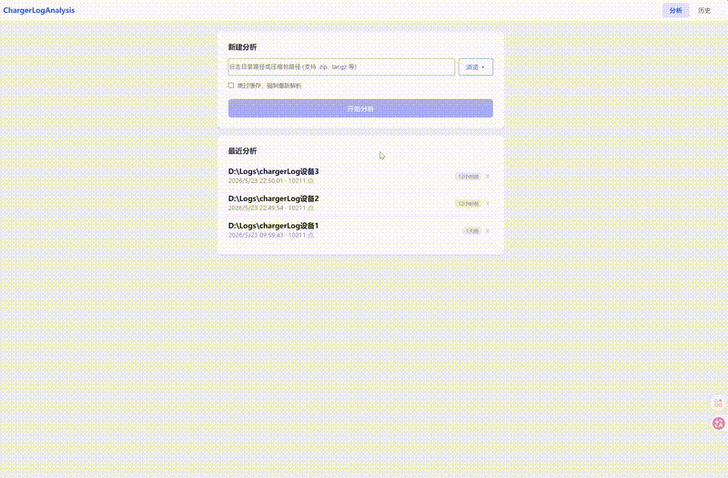

# ChargerLogAnalysis

Android 充电日志分析工具 — 解析 healthd 日志，可视化电池电压、电流、温度与充电周期。



## 用法

### 直接运行（打包产物）

解压 `ChargerLogApp.zip`，双击 `ChargerLogApp.exe` 一键启动，浏览器自动打开分析页面。

输入日志目录路径或选择压缩包即可开始分析。

### 开发者快速启动

```bash
pip install flask flask-cors

cd web && npm install && npm run build && cd ..

python launcher.py        # 浏览器自动打开 http://127.0.0.1:5000
```

### 完整打包

```bash
python build.py            # C++ 编译 → 前端构建 → PyInstaller 打包 → 输出 Zip
```

产物位于 `dist/ChargerLogApp.zip`。

### C++ CLI 独立使用

```bash
cd core && mkdir -p build && cd build
cmake -G "MinGW Makefiles" ..
cmake --build . --config Release

./chargerlog --json --points --downsample 500 /path/to/logs
```

## 技术栈

| 层 | 技术 |
|---|---|
| C++ 解析引擎 | C++17, healthd parser, FNV-1a 缓存 |
| Python 服务端 | Flask REST API |
| 前端 | Vue 3 + TypeScript + ECharts |

## 目录结构

```
├── core/             # C++ 解析引擎 + CLI
├── server/           # Flask API 服务
├── web/              # Vue 3 前端
├── launcher.py       # 桌面启动入口
├── build.py          # 一键构建打包脚本
└── 方案设计.md        # 详细设计文档
```
